En este tutorial aprenderás a instalar **GIT** y **GIT BASH** en **Windows 11** paso a paso. GIT es un sistema de control de versiones distribuido que te permite rastrear los cambios en tus proyectos de software y colaborar con otros desarrolladores de forma eficiente. GIT BASH es una terminal que te permite ejecutar comandos de GIT y otros comandos de Unix en Windows.

## Descargar e instalar GIT en Windows 11
Para instalar GIT en Windows 11, sigue estos pasos:

1. **Descarga GIT para Windows 11**
   - Abre tu navegador web y ve al sitio web oficial de GIT: [https://git-scm.com/](https://git-scm.com/)
   - Haz clic en el botón de descarga para Windows para descargar el instalador de GIT.

2. **Ejecuta el instalador de GIT**
    - Una vez que se haya descargado el instalador, haz doble clic en el archivo descargado para ejecutarlo.
    - Sigue las instrucciones del instalador para completar la instalación de GIT en Windows 11.

3. **Configura GIT**
    - Durante la instalación, se te pedirá que configures algunas opciones, como el editor de texto predeterminado, el nombre de la rama inicial y la configuración de la terminal.
    - Puedes elegir las opciones predeterminadas o personalizarlas según tus preferencias.

## Paos de instalación de GIT en Windows 11
A continuación, se muestran los pasos detallados para instalar GIT en Windows 11:

1. **Información**: Haz clic en `Next` para continuar con la instalación.

    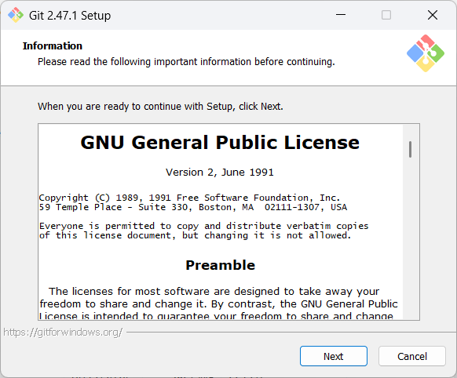

2. **Selecciona la ubicación de destino**: Puedes elegir la ubicación donde se instalará GIT en tu sistema. Haz clic en `Next` para continuar.

    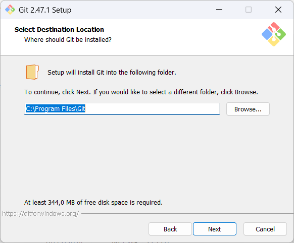

3. **Selecciona los componentes**: Puedes elegir los componentes que deseas instalar. Por lo general, es mejor dejar las opciones predeterminadas. Haz clic en `Next` para continuar.

    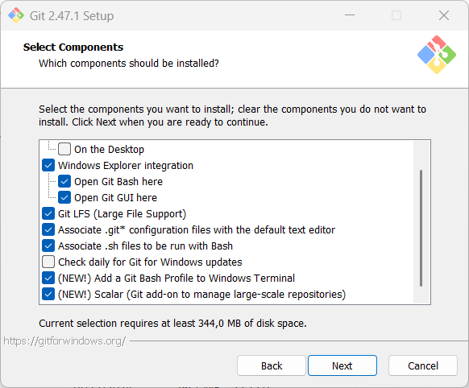

4. **Selecciona la carpeta del menú de inicio**: Puedes elegir la carpeta del menú de inicio donde se creará el acceso directo de GIT. Haz clic en `Next` para continuar.

    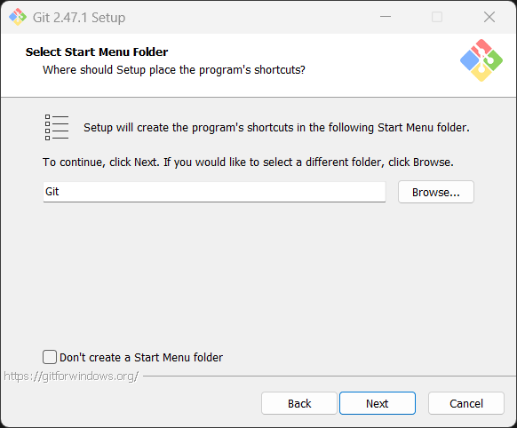

5. **Elige el editor de texto predeterminado**: Puedes elegir el editor de texto que GIT utilizará para mostrar los cambios. Puedes elegir `Vim` o `Nano` como editor de texto. Haz clic en `Next` para continuar.

    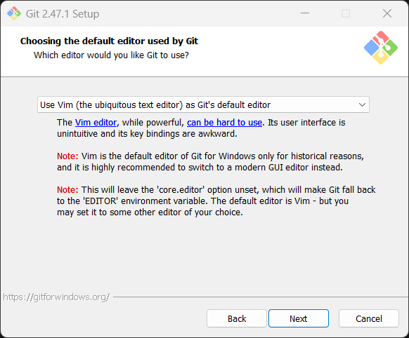

6. **Nombre de la rama inicial del nuevo repositorio**: Puedes elegir el nombre de la rama inicial de un nuevo repositorio GIT. Por lo general, es mejor dejar la opción predeterminada. Haz clic en `Next` para continuar.

    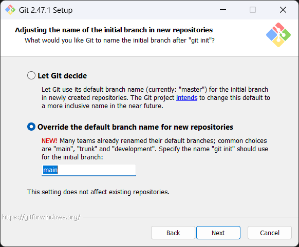

7. **Ajustar tu entorno PATH**: Puedes elegir cómo GIT ajustará tu entorno PATH. Por lo general, es mejor dejar la opción predeterminada. Haz clic en `Next` para continuar.

    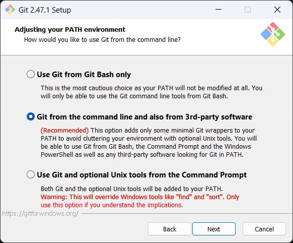

8. **Elige el ejecutable SSH**: Puedes elegir el ejecutable SSH que GIT utilizará para las conexiones SSH. Por lo general, es mejor dejar la opción predeterminada. Haz clic en `Next` para continuar.

    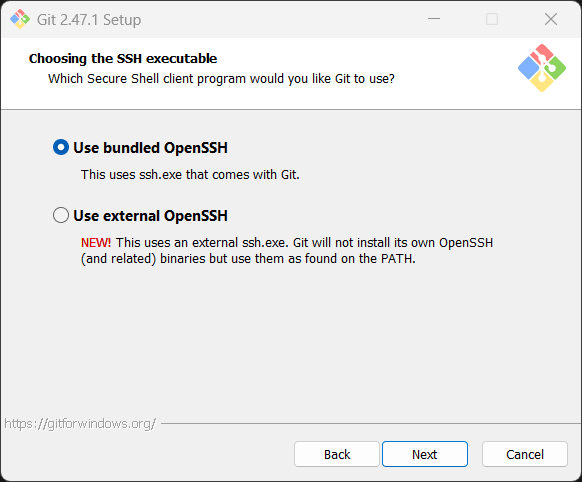

9. **Elige el backend de transporte HTTPS**: Puedes elegir el backend de transporte HTTPS que GIT utilizará para las conexiones HTTPS. Por lo general, es mejor dejar la opción predeterminada. Haz clic en `Next` para continuar.

    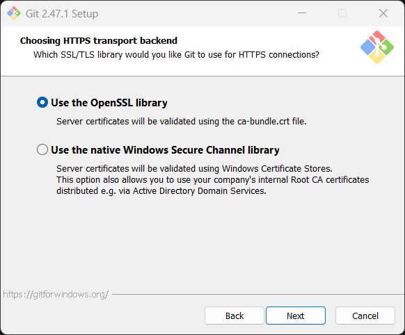

10. **Configurar las conversiones de fin de línea**: Puedes configurar cómo GIT manejará las conversiones de fin de línea. Por lo general, es mejor dejar la opción predeterminada. Haz clic en `Next` para continuar.

    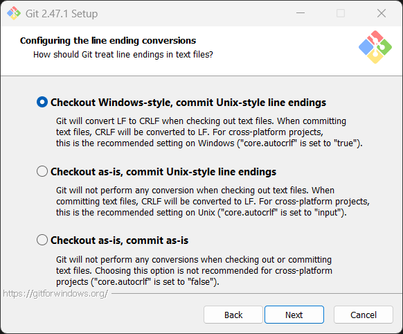

11. **Configurar el emulador de terminal para usar GIT BASH**: Puedes configurar el emulador de terminal que GIT utilizará para ejecutar GIT BASH. Por lo general, es mejor dejar la opción predeterminada. Haz clic en `Next` para continuar.

    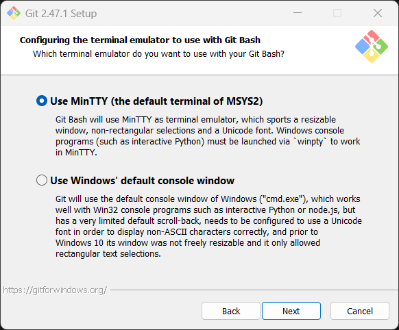

12. **Elige el comportamiento predeterminado de GIT PULL**: Puedes elegir el comportamiento predeterminado de GIT PULL. Por lo general, es mejor dejar la opción predeterminada. Haz clic en `Next` para continuar.

    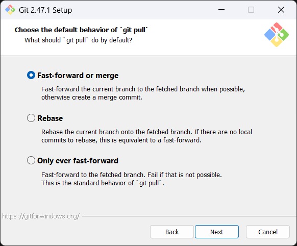

13. **Elige el ayudante de credenciales**: Puedes elegir el ayudante de credenciales que GIT utilizará para almacenar tus credenciales. Por lo general, es mejor dejar la opción predeterminada. Haz clic en `Next` para continuar.

    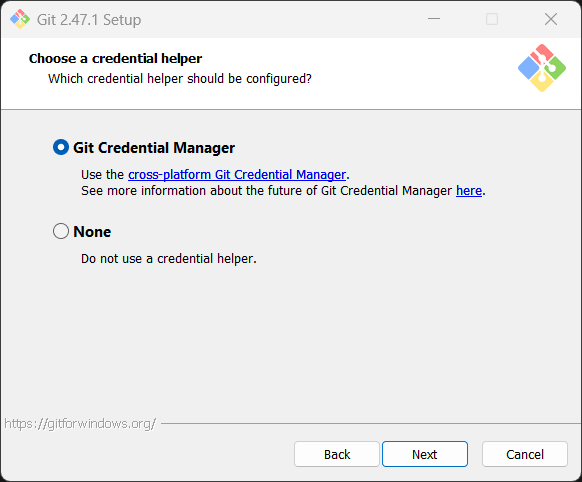

14. **Configurar opciones adicionales**: Puedes configurar opciones adicionales para GIT. Por lo general, es mejor dejar la opción predeterminada. Haz clic en `Next` para continuar.

    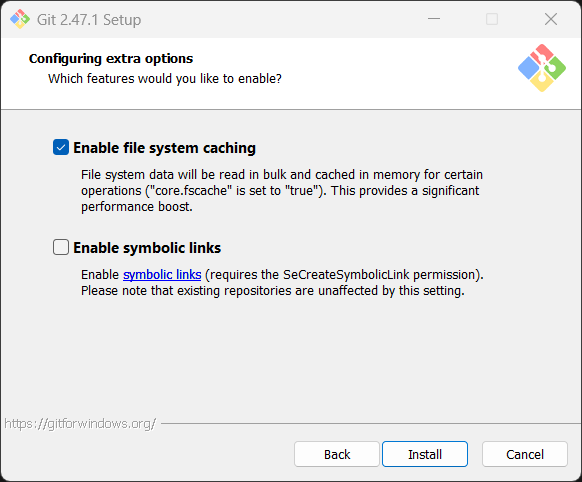

15. **Instalando GIT**: Haz clic en `Install` para comenzar la instalación de GIT en tu sistema.

    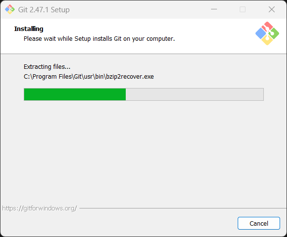

16. **Completa el asistente de configuración de GIT**: Una vez que la instalación haya finalizado, haz clic en `Finish` para completar el asistente de configuración de GIT.

    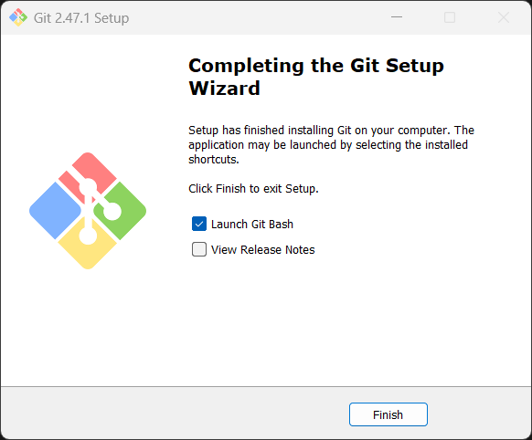


## Configuración inicial de GIT
Después de instalar GIT en Windows 11, es recomendable configurar tu nombre de usuario y dirección de correo electrónico para que tus contribuciones a los repositorios sean identificables. Puedes hacerlo ejecutando los siguientes comandos en la terminal de GIT BASH:

```bash
git config --global user.name "roelcode"
git config --global user.email "roelcode@ejemplo.com"
```

Estos comandos configurarán tu nombre de usuario y dirección de correo electrónico a nivel global, lo que significa que se aplicarán a todos los repositorios GIT en tu sistema.

## Inicializar un repositorio GIT
Para comenzar a utilizar GIT en un proyecto existente o en un nuevo proyecto, puedes inicializar un repositorio GIT en la carpeta del proyecto ejecutando el siguiente comando en la terminal de GIT BASH:

```bash
cd workspace/mi-proyecto
git init
```

Este comando inicializará un repositorio GIT en la carpeta `mi-proyecto` de tu directorio de trabajo, lo que te permitirá comenzar a rastrear los cambios en tu proyecto y colaborar con otros desarrolladores.

¡Felicidades! Ahora has instalado GIT y GIT BASH en Windows 11 y estás listo para comenzar a utilizar GIT en tus proyectos de software. Si tienes alguna pregunta o problema durante la instalación, no dudes en dejar un comentario a continuación.


